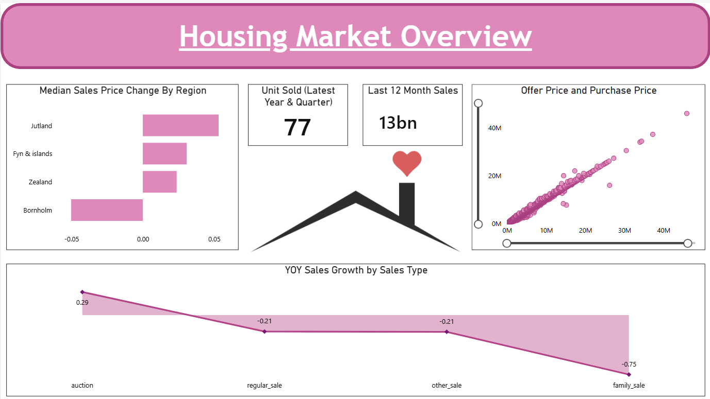
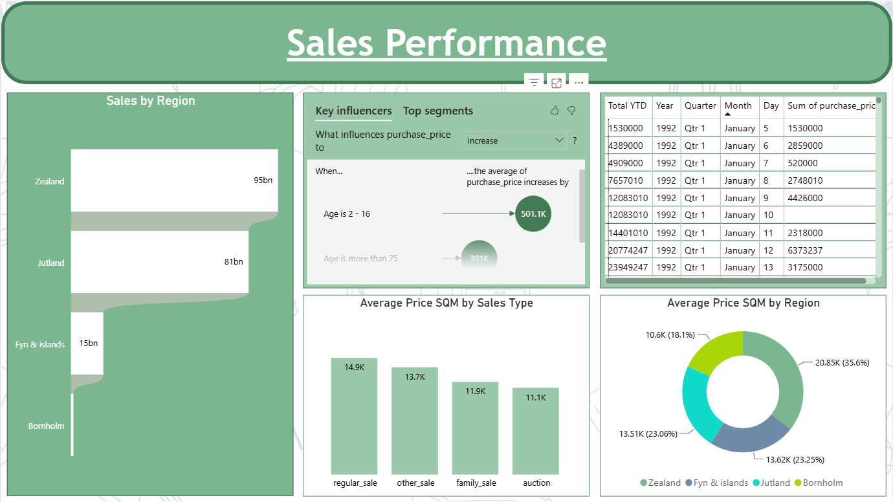
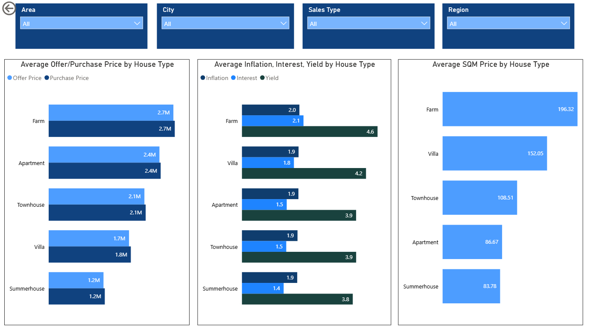

# 📊 HomeScape Analytics — Housing Market Dashboard

## 📌 Overview
HomeScape Analytics is an end-to-end data analytics project built using Google BigQuery and Power BI to analyze housing market trends, pricing patterns, and sales performance.

---

## 🛠️ Tech Stack
- Google BigQuery
- SQL (SSMS)
- Power BI
- Power Query Editor

---

## 🚀 How to Use

1. Download the `.pbix` file from this repository
2. Open it using Microsoft Power BI Desktop
3. If prompted, update the data source path
4. Refresh the data to view the latest insights

---

## 📊 Key Features
- Sales performance analysis by region  
- YOY sales growth tracking  
- Price comparison (Offer vs Purchase)  
- Median price change insights  
- Unit sold & last 12-month sales KPIs  
- Key influencers analysis (impact on price)  
- Interactive filters (City, Region, Area, Sales Type)

---

## 🔄 Data Workflow
- Data loaded into Google BigQuery  
- SQL used for exploration and transformation  
- Data cleaning handled in Power Query  
- Dashboard built in Power BI for insights  

---

## 📸 Dashboard Preview

### 📊 Dashboard 1

### 📊 Dashboard 2

### 📊 Dashboard 3

---

## 💡 Insights
- Identified regions with highest sales contribution  
- Analyzed price differences between offer and purchase  
- Tracked yearly growth trends in housing market  
- Highlighted factors influencing property prices  

---

## 📬 Contact
Feel free to fork and extend this project with new features and insights.  
